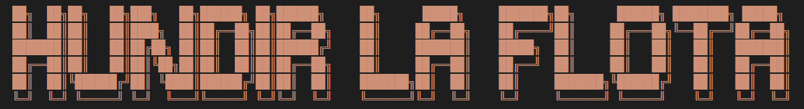

**Descripción del proyecto:**
Este proyecto consiste en un entregable desarrollado para el bootcamp de Data Science de The Bridge para mostrar las habilidades adquiridas de programación en Python. El código consiste en el juego "Hundir la Flota", donde un jugador/a se bate en duelo con la consola. Los barcos de ambos jugadores de colocarán de forma aleatoria en un tablero de 10x10 posiciones y, por turnos, dispararán a las posiciones con el objetivo de hundir la flota completa del enemigo.

**Reglas:**
1. El juego comenzará colocando los barcos tanto del bot como del jugador principal de forma aleatoria
2. Por turnos, los jugadores seleccionarán una coordenada concreta, con la intención de destruir los barcos
3. Si la coordenada seleccionada está ocupada por un barco, el juego indicará "tocado" y el turno continuará. Por el contrario, si la coordenada es agua, el juego indicará "agua" y perderá su turno.
4. El primer jugador que destruya la flota completa al jugador contrario ganará la partida.

**Creadores:**
- Jimena Alía Guerrero
- Diego J. Martínez Tortosa
---
**Project description:**
This is a project for The Bridge's Data Science bootcamp where we show the acquired Python programming skills. The code consists in the game "BattleShip", where one player duels against the bot. The ships of both players will be randomly placed on a 10x10 position board and they will shoot at the positions with the main objective of sinking the enemy's fleet.

**Rules:**
1. The game will start by randomly placing the ships of both the bot and the main player.
2. In turns, players will select a specific coordinate, with the intention of destroying the ships.
3. If the selected coordinate is occupied by a ship, the game will indicate "tocado" and the turn will continue. On the other hand, if the coordinate is water, the game will indicate "agua" and you will lose your turn.
4. The first player to destroy the entire fleet to the opposing player will win the game.

**Creators:**
Jimena Alía Guerrero
Diego J. Martínez Tortosa

